# TÀI LIỆU LUỒNG NGHIỆP VỤ CÁC BUSINESS SERVICE (BUSINESS SERVICE FLOWS)
**Dự án:** Mạng xã hội Connect (ConnectCG)  
**Công nghệ:** Spring Boot 3, Spring Security (JWT & OAuth2), Spring Data JPA, WebSocket (STOMP), Gemini AI Moderation, Firebase Realtime Database, MySQL/PostgreSQL.

---

## MỤC LỤC
1. [Sơ Đồ Kiến Trúc Hệ Thống Tổng Thể](#1-sơ-đồ-kiến-trúc-hệ-thống-tổng-thể)
2. [Module 1: Xác Thực & Quản Lý Tài Khoản (Authentication Flows)](#2-module-1-xác-thực--quản-lý-tài-khoản-authentication-flows)
3. [Module 2: Quản Lý Bài Viết & Kiểm Duyệt AI (Post & AI Moderation Flows)](#3-module-2-quản-lý-bài-viết--kiểm-duyệt-ai-post--ai-moderation-flows)
4. [Module 3: Bình Luận & Cảm Xúc (Comment & Reaction Flows)](#4-module-3-bình-luận--cảm-xúc-comment--reaction-flows)
5. [Module 4: Quản Lý Hội Nhóm (Group & Community Flows)](#5-module-4-quản-lý-hội-nhóm-group--community-flows)
6. [Module 5: Bạn Bè & Thuật Toán Gợi Ý (Friend System & Suggestion Flows)](#6-module-5-bạn-bè--thuật-toán-gợi-ý-friend-system--suggestion-flows)
7. [Module 6: Nhắn Tin Thời Gian Thực & Mã Hóa E2EE (Chat & E2EE Flows)](#7-module-6-nhắn-tin-thời-gian-thực--mã-hóa-e2ee-chat--e2ee-flows)
8. [Module 7: Trạng Thái Hoạt Động (Presence Flows)](#8-module-7-trạng-thái-hoạt-động-presence-flows)
9. [Module 8: Hồ Sơ Cá Nhân & Tìm Kiếm Thành Viên (Profile & Discovery Flows)](#9-module-8-hồ-sơ-cá-nhân--tìm-kiếm-thành-viên-profile--discovery-flows)
10. [Module 9: Hệ Thống Thông Báo Thời Gian Thực (Notification Flows)](#10-module-9-hệ-thống-thông-báo-thời-gian-thực-notification-flows)
11. [Module 10: Báo Cáo Vi Phạm & Quản Trị Hệ Thống (Report & Admin Flows)](#11-module-10-báo-cáo-vi-phạm--quản-trị-hệ-thống-report--admin-flows)
12. [Bảng Kênh STOMP WebSocket Đầy Đủ](#12-bảng-kênh-stomp-websocket-đầy-đủ)

---

## 1. SƠ ĐỒ KIẾN TRÚC HỆ THỐNG TỔNG THỂ

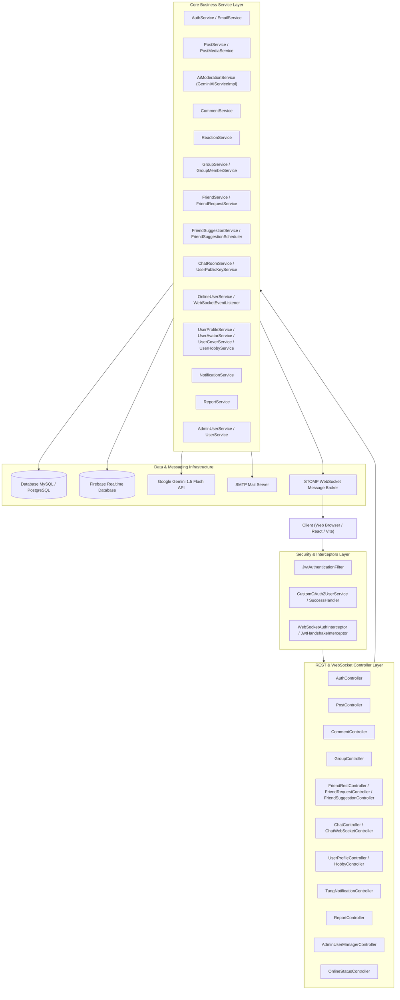

---

## 2. MODULE 1: XÁC THỰC & QUẢN LÝ TÀI KHOẢN (AUTHENTICATION FLOWS)

### 2.1 Luồng Đăng Ký & Kích Hoạt Tài Khoản Qua Email (Registration & Verification)
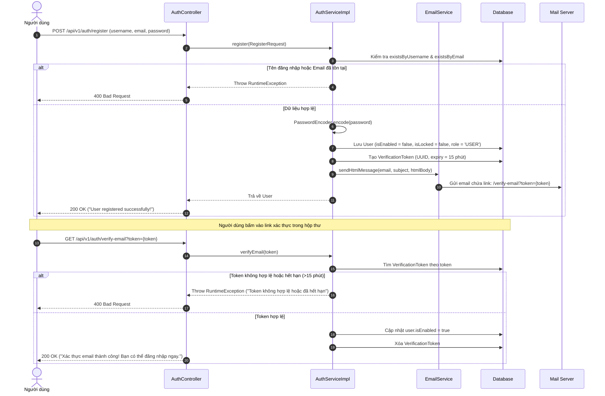

### 2.2 Luồng Đăng Nhập & Tạo JWT Token (Login & Token Generation)
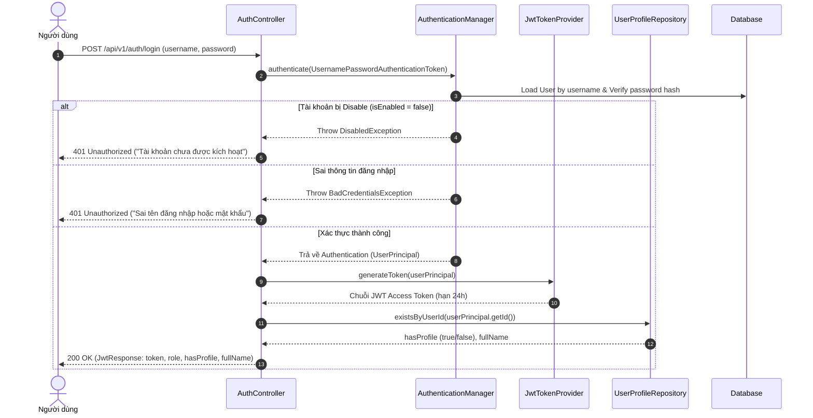

### 2.3 Luồng Đăng Nhập Mạng Xã Hội (OAuth2 Login - Google)
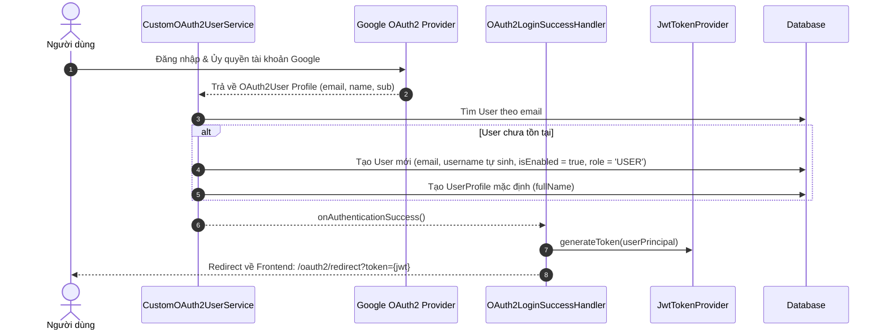

### 2.4 Luồng Khởi Tạo Hồ Sơ Sau Đăng Ký (Onboarding Profile Creation)
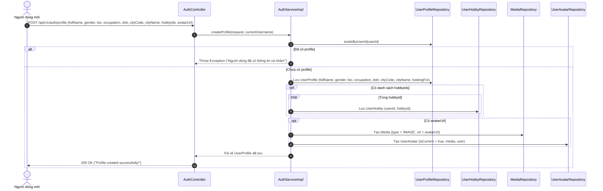

### 2.5 Luồng Quên Mật Khẩu & Đặt Lại Mật Khẩu (Forgot & Reset Password)
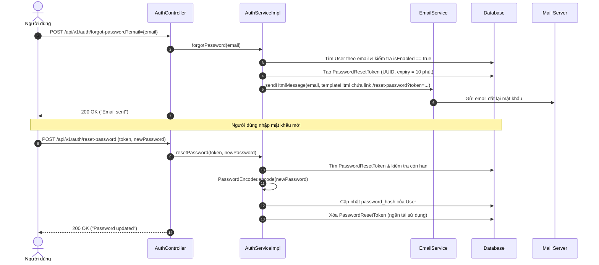

---

## 3. MODULE 2: QUẢN LÝ BÀI VIẾT & KIỂM DUYỆT AI (POST & AI MODERATION FLOWS)

### 3.1 Cây Quyết Định Kiểm Duyệt Nội Dung (AI Moderation Decision Flowchart)
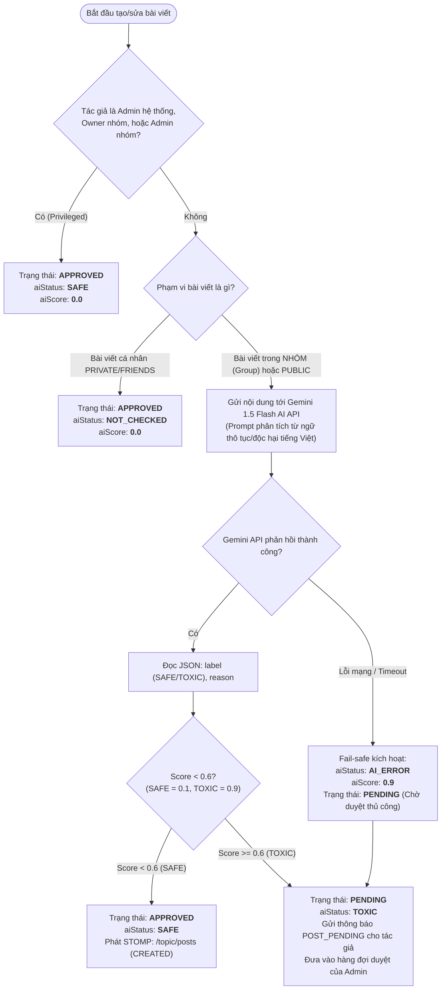

### 3.2 Luồng Tạo Bài Viết Chi Tiết (Create Post Sequence)
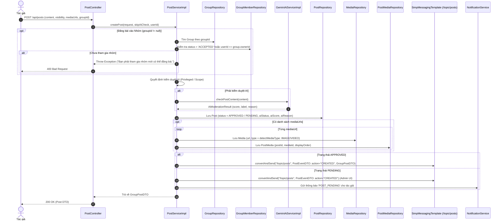

### 3.3 Luồng Duyệt / Từ Chối Bài Viết của Quản Trị Viên (Post Moderation Flow)
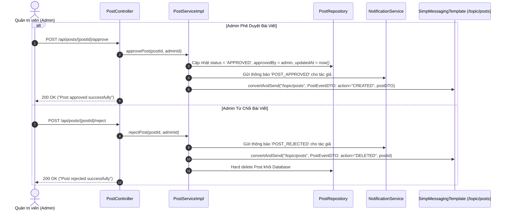

### 3.4 Luồng Chia Sẻ Bài Viết (Share Post Flow)
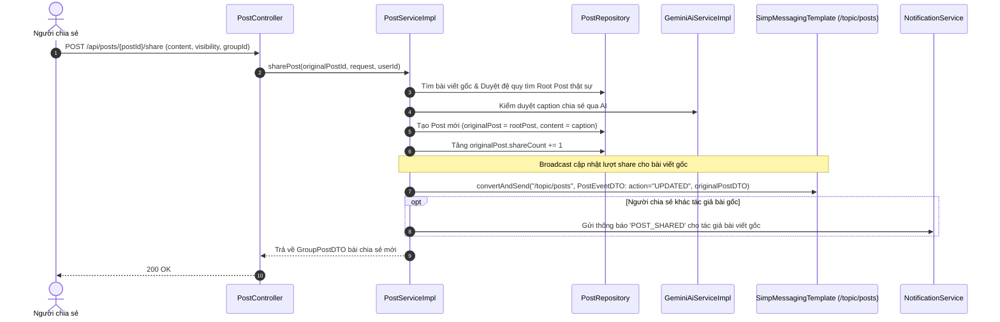

---

## 4. MODULE 3: BÌNH LUẬN & CẢM XÚC (COMMENT & REACTION FLOWS)

### 4.1 Luồng Tạo Bình Luận Cây Phân Cấp (Nested Tree Comments Flow)
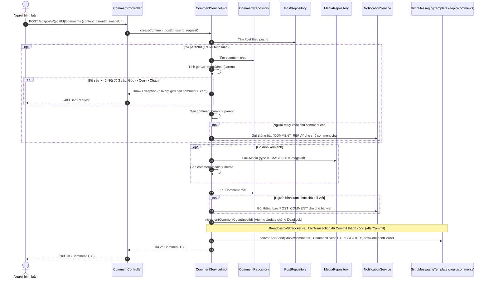

### 4.2 Luồng Thả Cảm Xúc / Đổi Cảm Xúc / Bỏ Cảm Xúc (Reaction Lifecycle)
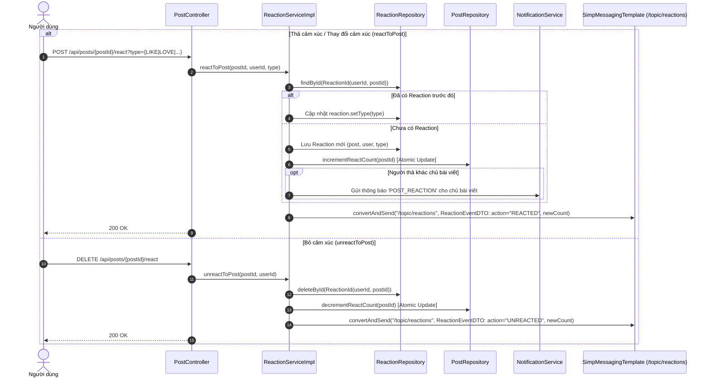

---

## 5. MODULE 4: QUẢN LÝ HỘI NHÓM (GROUP & COMMUNITY FLOWS)

### 5.1 Máy Trạng Thái Thành Viên Nhóm (Group Membership State Machine)
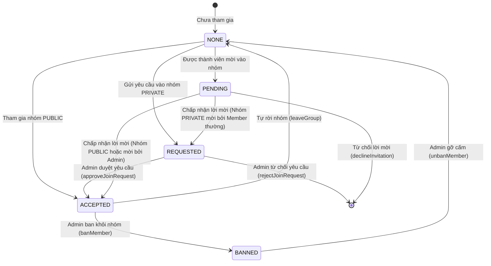

### 5.2 Luồng Tham Gia Nhóm Public vs Private (Join Group Flow)
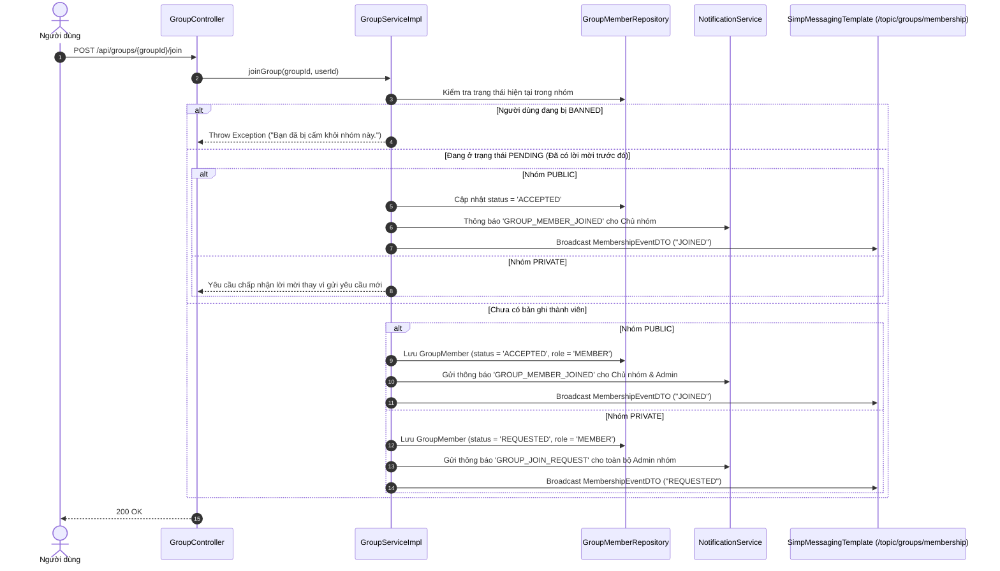

### 5.3 Luồng Mời Thành Viên & Phê Duyệt 2 Bước (Invitation & 2-Step Approval)
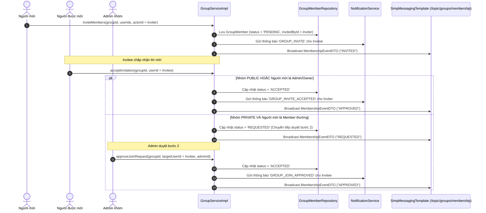

### 5.4 Luồng Cấm Thành Viên & Tự Động Quét Dọn Bài Viết Vi Phạm (Ban & Auto-cleanup)
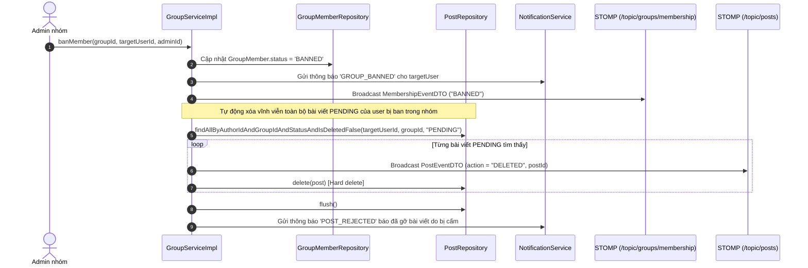

---

## 6. MODULE 5: BẠN BÈ & THUẬT TOÁN GỢI Ý (FRIEND SYSTEM & SUGGESTION FLOWS)

### 6.1 Luồng Vòng Đời Lời Mời Kết Bạn (Friend Request Lifecycle)
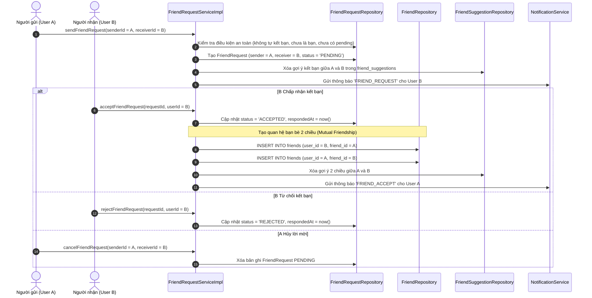

### 6.2 Thuật Toán Gợi Ý Bạn Bè SQL CTE Đa Tiêu Chí (Scoring Engine)
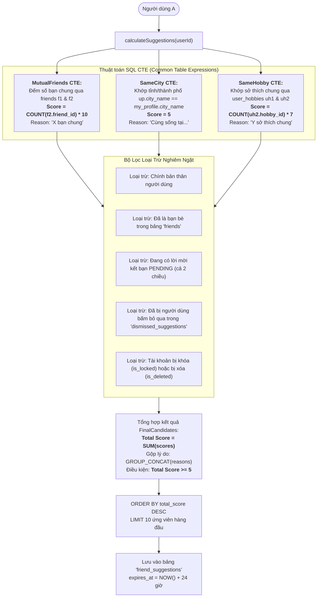

### 6.3 Lịch Trình Tự Động Định Kỳ (Friend Suggestion Scheduler)
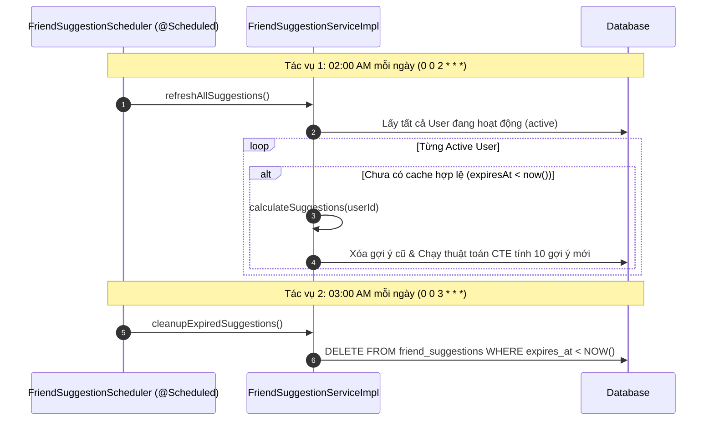

---

## 7. MODULE 6: NHẮN TIN THỜI GIAN THỰC & MÃ HÓA E2EE (CHAT & E2EE FLOWS)

### 7.1 Mô Hình Phối Hợp Backend - Firebase - Client E2EE
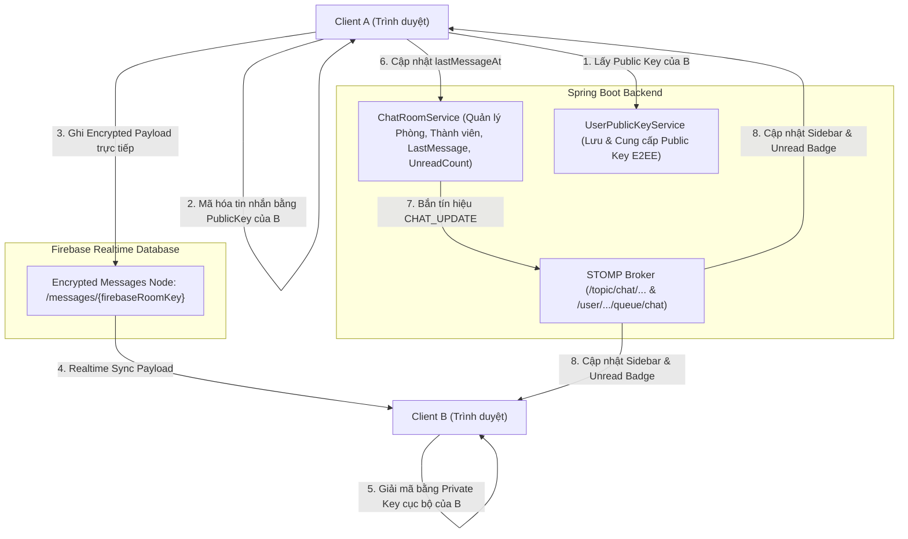

### 7.2 Luồng Nhắn Tin E2EE & Cập Nhật Unread Count (End-to-End Encrypted Message Flow)
```mermaid
sequenceDiagram
    autonumber
    actor A as User A
    actor B as User B
    participant ChatCtrl as ChatController
    participant KeyCtrl as UserPublicKeyController
    participant ChatSvc as ChatRoomServiceImpl
    participant Firebase as Firebase Realtime DB
    participant Ws as SimpMessagingTemplate (/user/{username}/queue/chat)

    Note over A, KeyCtrl: Bước 1: Lấy Public Key của đối phương
    A->>KeyCtrl: GET /api/keys/{userId_B}
    KeyCtrl-->>A: publicKey của B

    Note over A, Firebase: Bước 2: Mã hóa & Lưu tin nhắn vào Firebase
    A->>A: Mã hóa nội dung tin nhắn bằng RSA/ECDH Public Key của B
    A->>Firebase: Ghi tin nhắn mã hóa vào node /messages/{firebaseRoomKey}

    Note over A, ChatSvc: Bước 3: Báo Backend cập nhật thời gian tin nhắn cuối
    A->>ChatCtrl: POST /api/chat/last-message (firebaseRoomKey)
    ChatCtrl->>ChatSvc: updateLastMessageAt(firebaseRoomKey, userA)
    ChatSvc->>ChatSvc: Cập nhật room.lastMessageAt = now() & memberA.lastReadAt = now()
    ChatSvc->>Ws: Gửi CHAT_UPDATE cho A (unreadCount = 0)
    ChatSvc->>Ws: Gửi CHAT_UPDATE cho B (unreadCount = 1)

    Note over B, Firebase: Bước 4: Nhận và giải mã tại Client B
    Firebase-->>B: Nhận tin nhắn mã hóa từ Firebase Realtime Listener
    B->>B: Giải mã tin nhắn bằng Private Key lưu trong LocalStorage/IndexedDB của B
```

### 7.3 Luồng Đánh Dấu Đã Đọc & Tín Hiệu Seen (Read Receipt Flow)
```mermaid
sequenceDiagram
    autonumber
    actor B as User B (Người đọc)
    actor A as User A (Người gửi)
    participant ChatCtrl as ChatController
    participant ChatSvc as ChatRoomServiceImpl
    participant MemberRepo as ChatRoomMemberRepository
    participant WsSeen as STOMP (/topic/chat/{key}/seen)
    participant WsQueue as STOMP (/user/{username}/queue/chat)

    B->>ChatCtrl: PUT /api/chat/{roomId}/read
    ChatCtrl->>ChatSvc: markAsRead(roomId, userB)
    ChatSvc->>MemberRepo: Cập nhật memberB.lastReadAt = now()
    
    Note over ChatSvc, WsSeen: Phát tín hiệu "Đã xem" tới phòng chat
    ChatSvc->>WsSeen: convertAndSend(ReadReceiptDTO: roomId, userId = B, lastReadAt = now())
    WsSeen-->>A: User A nhận tín hiệu và hiển thị avatar User B đã xem đến tin nhắn này

    Note over ChatSvc, WsQueue: Cập nhật lại sidebar của User B (unreadCount = 0)
    ChatSvc->>WsQueue: Gửi CHAT_UPDATE cho B (unreadCount = 0)
```

---

## 8. MODULE 7: TRẠNG THÁI HOẠT ĐỘNG (PRESENCE FLOWS)

```mermaid
sequenceDiagram
    autonumber
    actor Client as Người dùng
    participant WsListener as WebSocketEventListener
    participant OnlineSvc as OnlineUserService (ConcurrentHashMap)
    participant WsBroker as STOMP (/topic/public/status)

    Note over Client, WsListener: 1. Khi Client kết nối WebSocket STOMP
    Client->>WsListener: SessionConnectedEvent (Principal: UserPrincipal)
    WsListener->>OnlineSvc: addUser(userId)
    WsListener->>WsBroker: convertAndSend("/topic/public/status", UserStatusDTO: userId, status="ONLINE")
    WsBroker-->>Client: Tất cả người dùng đang online nhận thông báo User này ONLINE

    Note over Client, OnlineSvc: 2. Khi Client tải trang (Lấy danh sách online ban đầu)
    Client->>OnlineSvc: GET /api/users/online
    OnlineSvc-->>Client: 200 OK (Set<Integer> onlineUserIds)

    Note over Client, WsListener: 3. Khi Client ngắt kết nối WebSocket (Đóng trình duyệt / Mất mạng)
    Client-xWsListener: SessionDisconnectEvent (Principal: UserPrincipal)
    WsListener->>OnlineSvc: removeUser(userId)
    WsListener->>WsBroker: convertAndSend("/topic/public/status", UserStatusDTO: userId, status="OFFLINE")
    WsBroker-->>Client: Tất cả người dùng nhận thông báo User này OFFLINE
```

---

## 9. MODULE 8: HỒ SƠ CÁ NHÂN & TÌM KIẾM THÀNH VIÊN (PROFILE & DISCOVERY FLOWS)

### 9.1 Sơ Đồ Quyết Định Hiển Thị Quyền Riêng Tư (Profile Privacy Flowchart)
```mermaid
flowchart TD
    Req(["Yêu cầu xem Profile: getUserProfile(targetUserId, currentUserId)"]) --> Rel{"Xác định mối quan hệ<br>(determineRelationship)"}

    Rel -- "targetUserId == currentUserId" --> Self["Mối quan hệ: <b>SELF</b>"]
    Rel -- "Tồn tại trong bảng 'friends'" --> Friend["Mối quan hệ: <b>FRIEND</b>"]
    Rel -- "Tồn tại trong 'friend_requests' (PENDING)" --> Pending["Mối quan hệ: <b>PENDING</b>"]
    Rel -- "Không tồn tại quan hệ" --> Stranger["Mối quan hệ: <b>STRANGER</b>"]

    Self --> FullView["<b>HIỂN THỊ ĐẦY ĐỦ (Full Profile):</b><br>+ Họ tên, Giới tính, Bio, Nghề nghiệp<br>+ <b>Email, Ngày sinh, Hôn nhân, Mục đích kết nối (LookingFor)</b><br>+ Tỉnh/Thành phố, Avatar, Cover, Gallery, Hobbies<br>+ Thống kê số bạn bè, số bài viết"]
    Friend --> FullView

    Pending --> MaskedView["<b>HIỂN THỊ CÔNG KHAI (Public Profile Only):</b><br>+ Họ tên, Giới tính, Bio, Nghề nghiệp<br>+ Tỉnh/Thành phố, Avatar, Cover, Gallery, Hobbies<br>+ Thống kê số bạn bè, số bài viết<br><br><b>ẨN THÔNG TIN NHẠY CẢM:</b><br>- Email (null)<br>- Ngày sinh (null)<br>- Tình trạng hôn nhân (null)<br>- Mục đích kết nối (null)"]
    Stranger --> MaskedView
```

### 9.2 Luồng Tìm Kiếm Thành Viên Ưu Tiên Theo Vị Trí & Mục Đích (Member Search Flow)
```mermaid
flowchart TD
    UserQuery(["Người dùng tìm kiếm: searchMembers(keyword, gender, cityCode, maritalStatus, lookingFor)"]) --> FetchCurrent["Lấy thông tin của người tìm kiếm:<br>- currentUserCityCode<br>- currentUserLookingFor"]

    FetchCurrent --> QueryDB["Thực thi userProfileRepository.searchMembers()"]

    subgraph Scoring_Order ["Thuật Toán Sắp Xếp Ưu Tiên (Order Priority)"]
        O1["<b>Ưu tiên 1:</b> Cùng Tỉnh/Thành phố (city_code == currentUserCityCode)"]
        O2["<b>Ưu tiên 2:</b> Cùng Mục đích kết nối (looking_for == currentUserLookingFor)"]
        O3["<b>Ưu tiên 3:</b> Thời gian cập nhật gần nhất (updated_at DESC)"]
    end

    QueryDB --> Scoring_Order
    Scoring_Order --> EnrichAvatar["Lấy avatar hiện tại của từng ứng viên (getCurrentAvatar)"]
    EnrichAvatar --> RetPage["Trả về Page&lt;MemberSearchResponse&gt;"]
```

---

## 10. MODULE 9: HỆ THỐNG THÔNG BÁO THỜI GIAN THỰC (NOTIFICATION FLOWS)

```mermaid
sequenceDiagram
    autonumber
    participant EventSource as Các Service (Post/Friend/Group/Report...)
    participant NotiSvc as NotificationServiceImpl
    participant NotiRepo as NotificationRepository
    participant ProfileRepo as UserProfileRepository
    participant AvatarRepo as UserAvatarRepository
    participant Ws as SimpMessagingTemplate (/user/{username}/queue/notifications)
    actor Receiver as Người nhận

    EventSource->>NotiSvc: sendNotification(TungNotificationDTO, receiver, actor)
    NotiSvc->>NotiRepo: Lưu Notification entity vào Database (isRead = false, createdAt = now())
    
    opt Có tác nhân hành động (actor != null)
        NotiSvc->>ProfileRepo: Lấy fullName của actor
        NotiSvc->>AvatarRepo: Lấy avatarUrl hiện tại của actor
    end

    NotiSvc->>NotiSvc: Đóng gói TungNotificationDTO đầy đủ thông tin
    NotiSvc->>Ws: convertAndSendToUser(receiver.getUsername(), "/queue/notifications", dto)
    Ws-->>Receiver: Nhận thông báo Popup / Toast tức thì trên giao diện
```

---

## 11. MODULE 10: BÁO CÁO VI PHẠM & QUẢN TRỊ HỆ THỐNG (REPORT & ADMIN FLOWS)

### 11.1 Luồng Báo Cáo Vi Phạm & Xử Lý (Report Submission & Resolution)
```mermaid
sequenceDiagram
    autonumber
    actor User as Người báo cáo
    actor Admin as Quản trị viên
    participant ReportCtrl as ReportController
    participant ReportSvc as ReportServiceImpl
    participant ReportRepo as ReportRepository
    participant UserRepo as UserRepository
    participant NotiSvc as NotificationService

    User->>ReportCtrl: POST /api/reports (targetType: POST/GROUP/USER, targetId, reason)
    ReportCtrl->>ReportSvc: createReport(request, username)
    ReportSvc->>ReportRepo: Lưu Report (status = 'PENDING', reporter = User, createdAt = now())
    ReportSvc->>UserRepo: findByRole("ADMIN")
    loop Từng Admin hệ thống
        ReportSvc->>NotiSvc: Gửi thông báo 'REPORT_SUBMITTED' qua WebSocket
    end
    ReportCtrl-->>User: 200 OK ("Report submitted successfully")

    Note over Admin, ReportSvc: Admin xử lý báo cáo vi phạm
    Admin->>ReportCtrl: PUT /api/reports/{id} (status: 'RESOLVED' / 'REVIEWING')
    ReportCtrl->>ReportSvc: updateReport(id, request, adminUsername)
    ReportSvc->>ReportRepo: Cập nhật report.status, reviewer = Admin
    ReportSvc->>NotiSvc: Gửi thông báo 'REPORT_UPDATED' cho User đã báo cáo
    ReportCtrl-->>Admin: 200 OK
```

### 11.2 Luồng Quản Trị Người Dùng & Rào Chắn Tự Bảo Vệ (Admin Guard Rails Flowchart)
```mermaid
flowchart TD
    Action(["Admin thực hiện: Khóa / Xóa / Hạ quyền người dùng"]) --> CheckSelf{"Admin có đang tự thao tác<br>trên chính mình không?<br>(adminId == targetUserId)"}

    CheckSelf -- Có --> ThrowSelfError["Ném ngoại lệ: <b>Chặn tự thao tác</b><br>('Admin không thể tự thao tác trên chính mình')"]

    CheckSelf -- Không --> CheckRole{"Mục tiêu có vai trò là ADMIN không?<br>(targetUser.role == 'ADMIN')"}

    CheckRole -- Có --> CountAdmins{"Đếm số Admin đang hoạt động:<br>countByRoleAndIsDeletedFalseAndIsLockedFalse('ADMIN')"}
    CountAdmins -- "<= 1 (Chỉ còn 1 Admin duy nhất)" --> ThrowLastAdminError["Ném ngoại lệ: <b>Bảo vệ Admin cuối cùng</b><br>('Không thể khóa/xóa/hạ cấp Quản trị viên cuối cùng của hệ thống')"]
    
    CountAdmins -- "> 1" --> ExecuteAction["Cho phép thực hiện"]
    CheckRole -- Không (User thường) --> ExecuteAction

    ExecuteAction --> UpdateDB["Cập nhật User trong Database"]
    UpdateDB --> CheckActionType{"Hành động là gì?"}

    CheckActionType -- "Khóa (LOCK)" --> SendLock["Gửi sự kiện realtime qua STOMP:<br>/user/{username}/queue/errors (type: 'LOCK')<br>=> Ép trình duyệt người dùng đăng xuất ngay"]
    CheckActionType -- "Xóa (DELETE)" --> SendDelete["Gửi sự kiện realtime qua STOMP:<br>/user/{username}/queue/errors (type: 'DELETE')<br>=> Ép trình duyệt người dùng đăng xuất ngay"]
    CheckActionType -- "Đổi vai trò" --> SendRoleNoti["Gửi thông báo 'ROLE_CHANGE' cho người dùng"]
```

---

## 12. BẢNG KÊNH STOMP WEBSOCKET ĐẦY ĐỦ

| Kênh STOMP | Loại Kênh | Payload DTO | Mô tả chức năng |
| :--- | :--- | :--- | :--- |
| `/topic/posts` | Broadcast | `PostEventDTO` | Phát sự kiện bài viết mới (`CREATED`), chỉnh sửa (`UPDATED`), xóa bài (`DELETED`) trên toàn mạng xã hội |
| `/topic/comments` | Broadcast | `CommentEventDTO` | Phát sự kiện bình luận mới hoặc xóa bình luận, kèm `commentCount` cập nhật |
| `/topic/reactions` | Broadcast | `ReactionEventDTO` | Phát sự kiện thả cảm xúc (`REACTED`) hoặc bỏ cảm xúc (`UNREACTED`), kèm `reactCount` cập nhật |
| `/topic/groups/membership` | Broadcast | `MembershipEventDTO` | Phát sự kiện thay đổi thành viên nhóm (`JOINED`, `LEFT`, `INVITED`, `APPROVED`, `BANNED`) |
| `/topic/public/status` | Broadcast | `UserStatusDTO` | Phát trạng thái hiện diện thời gian thực (`ONLINE` / `OFFLINE`) của người dùng |
| `/topic/chat/{firebaseRoomKey}/typing` | Broadcast | `TypingEventDTO` | Phát hiệu ứng đang gõ tin nhắn trong phòng chat cụ thể |
| `/topic/chat/{firebaseRoomKey}/seen` | Broadcast | `ReadReceiptDTO` | Phát tín hiệu đã xem (Seen) đến người gửi tin nhắn trong phòng chat |
| `/user/{username}/queue/notifications` | Point-to-Point | `TungNotificationDTO` | Đẩy thông báo cá nhân (kết bạn, tương tác bài viết, hội nhóm, hệ thống) |
| `/user/{username}/queue/chat` | Point-to-Point | `Map<String, Object>` | Đồng bộ danh sách phòng chat, số tin chưa đọc, sự kiện bị xóa khỏi nhóm chat |
| `/user/{username}/queue/errors` | Point-to-Point | `Map<String, String>` | Đẩy thông báo lỗi khẩn cấp (tài khoản bị khóa/xóa) để ép client đăng xuất tức thì |

---
*Tài liệu được thiết kế chi tiết bằng biểu đồ Mermaid trực quan cho toàn bộ luồng nghiệp vụ Backend của dự án Connect (ConnectCG).*
