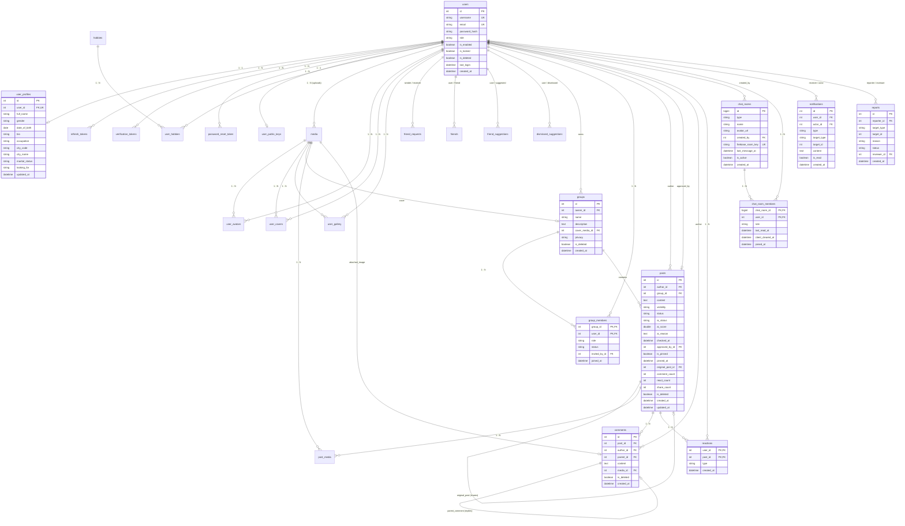

# TÀI LIỆU CƠ SỞ DỮ LIỆU (DATABASE SCHEMA & ERD)
**Dự án:** Mạng xã hội Connect (ConnectCG)  
**Hệ quản trị CSDL:** MySQL / PostgreSQL (Quản lý qua Flyway Migration)  
**Charset/Collation:** `utf8mb4` / `utf8mb4_unicode_ci`

---

## MỤC LỤC
1. [Sơ Đồ Thực Thể Quan Hệ Tổng Thể (Full ERD Diagram)](#1-sơ-đồ-thực-thể-quan-hệ-tổng-thể-full-erd-diagram)
2. [Module 1: Người Dùng & Xác Thực (Users & Authentication)](#2-module-1-người-dùng--xác-thực-users--authentication)
3. [Module 2: Hồ Sơ Cá Nhân & Media (Profiles & Media System)](#3-module-2-hồ-sơ-cá-nhân--media-profiles--media-system)
4. [Module 3: Mạng Lưới Bạn Bè & GỢI Ý (Friend System & Suggestions)](#4-module-3-mạng-lưới-bạn-bè--gợi-ý-friend-system--suggestions)
5. [Module 4: Hội Nhóm & Cộng Đồng (Groups & Community)](#5-module-4-hội-nhóm--cộng-đồng-groups--community)
6. [Module 5: Bài Viết & Tương Tác (Posts, Comments & Reactions)](#6-module-5-bài-viết--tương-tác-posts-comments--reactions)
7. [Module 6: Nhắn Tin Thời Gian Thực & E2EE (Chat & Encryption)](#7-module-6-nhắn-tin-thời-gian-thực--e2ee-chat--encryption)
8. [Module 7: Thông Báo & Báo Cáo Vi Phạm (Notifications & Reports)](#8-module-7-thông-báo--báo-cáo-vi-phạm-notifications--reports)
9. [Tổng Hợp Chỉ Mục Tối Ưu Hóa (Indexes & Performance)](#9-tổng-hợp-chỉ-mục-tối-ưu-hóa-indexes--performance)
10. [Danh Mục Ràng Buộc Nghiệp Vụ (Check Constraints & Enums)](#10-danh-mục-ràng-buộc-nghiệp-vụ-check-constraints--enums)

---

## 1. SƠ ĐỒ THỰC THỂ QUAN HỆ TỔNG THỂ (FULL ERD DIAGRAM)



---

## 2. MODULE 1: NGƯỜI DÙNG & XÁC THỰC (USERS & AUTHENTICATION)

### 2.1 Bảng `users` (Tài khoản người dùng hệ thống)
Lưu trữ thông tin định danh đăng nhập, trạng thái tài khoản, vai trò và lịch sử khóa.

| Tên Cột | Kiểu Dữ Liệu | Ràng Buộc | Mặc Định | Nullable | Mô Tả Nghiệp Vụ |
| :--- | :--- | :--- | :--- | :--- | :--- |
| `id` | `INT` | **PRIMARY KEY**, Auto Increment | | `NO` | Khóa chính ID người dùng |
| `username` | `VARCHAR(50)` | **UNIQUE** (`uk_users_username`) | | `NO` | Tên đăng nhập duy nhất |
| `email` | `VARCHAR(100)` | **UNIQUE** (`uk_users_email`) | | `NO` | Địa chỉ email duy nhất |
| `password_hash` | `VARCHAR(255)` | | | `NO` | Mật khẩu băm bằng BCrypt (cost=10) |
| `role` | `VARCHAR(20)` | `CHECK (role IN ('ADMIN', 'USER'))` | `'USER'` | `NO` | Vai trò (`ADMIN`, `USER`) |
| `is_enabled` | `BOOLEAN` | | `FALSE` | `NO` | Trạng thái kích hoạt email (`TRUE` khi đã click link xác thực) |
| `is_locked` | `BOOLEAN` | | `FALSE` | `NO` | Trạng thái bị Admin khóa tài khoản |
| `is_deleted` | `BOOLEAN` | | `FALSE` | `NO` | Trạng thái xóa mềm (Soft delete) |
| `violation_count` | `INT` | | `0` | `YES` | Số lần vi phạm chuẩn mực cộng đồng |
| `last_violation_at`| `TIMESTAMP` | | `NULL` | `YES` | Thời điểm vi phạm gần nhất |
| `locked_until` | `TIMESTAMP` | | `NULL` | `YES` | Thời hạn khóa tạm thời |
| `permanent_locked` | `BOOLEAN` | | `FALSE` | `YES` | Khóa vĩnh viễn |
| `last_login` | `DATETIME` | | `NULL` | `YES` | Thời điểm đăng nhập gần nhất |
| `created_at` | `DATETIME` | | `CURRENT_TIMESTAMP` | `YES` | Thời điểm tạo tài khoản |

---

### 2.2 Bảng `verification_tokens` (Mã xác thực kích hoạt tài khoản Email)
Quản lý token ngẫu nhiên gửi qua email đăng ký để kích hoạt tài khoản.

| Tên Cột | Kiểu Dữ Liệu | Ràng Buộc | Mặc Định | Nullable | Mô Tả Nghiệp Vụ |
| :--- | :--- | :--- | :--- | :--- | :--- |
| `id` | `INT` | **PRIMARY KEY**, Auto Increment | | `NO` | Khóa chính ID token xác thực |
| `token` | `VARCHAR(255)` | | | `NO` | Chuỗi UUID xác thực ngẫu nhiên |
| `user_id` | `INT` | **FOREIGN KEY** $\to$ `users(id)` **ON DELETE CASCADE** | | `NO` | ID người dùng cần kích hoạt |
| `expiry_date` | `DATETIME` | | | `NO` | Thời gian hết hạn (15 phút sau khi đăng ký) |
| `created_at` | `DATETIME` | | `CURRENT_TIMESTAMP` | `YES` | Thời điểm tạo mã |

---

### 2.3 Bảng `password_reset_token` (Mã đặt lại mật khẩu quên)
Quản lý token cấp quyền đặt lại mật khẩu khi người dùng quên mật khẩu.

| Tên Cột | Kiểu Dữ Liệu | Ràng Buộc | Mặc Định | Nullable | Mô Tả Nghiệp Vụ |
| :--- | :--- | :--- | :--- | :--- | :--- |
| `id` | `BIGINT` | **PRIMARY KEY**, Auto Increment | | `NO` | Khóa chính ID token |
| `token` | `VARCHAR(255)` | | | `NO` | Chuỗi UUID ngẫu nhiên đặt lại mật khẩu |
| `user_id` | `INT` | **FOREIGN KEY** $\to$ `users(id)` **ON DELETE CASCADE** | | `NO` | ID người dùng yêu cầu đặt lại mật khẩu |
| `expiry_date` | `DATETIME` | | | `YES` | Thời hạn hiệu lực (10 phút) |

---

### 2.4 Bảng `refresh_tokens` (Quản lý phiên đăng nhập Refresh Token)
Lưu vết các phiên đăng nhập JWT Refresh Token trên từng thiết bị.

| Tên Cột | Kiểu Dữ Liệu | Ràng Buộc | Mặc Định | Nullable | Mô Tả Nghiệp Vụ |
| :--- | :--- | :--- | :--- | :--- | :--- |
| `id` | `BIGINT` | **PRIMARY KEY**, Auto Increment | | `NO` | Khóa chính ID token |
| `user_id` | `INT` | **FOREIGN KEY** $\to$ `users(id)` **ON DELETE CASCADE** | | `NO` | ID người dùng sở hữu token |
| `token_hash` | `VARCHAR(255)` | **UNIQUE** (`uk_refresh_tokens_hash`) | | `NO` | Mã băm của Refresh Token |
| `user_agent` | `TEXT` | | `NULL` | `YES` | Thiết bị / Trình duyệt đăng nhập |
| `ip_address` | `VARCHAR(45)` | | `NULL` | `YES` | Địa chỉ IP đăng nhập |
| `last_used_at` | `DATETIME` | | `NULL` | `YES` | Lần sử dụng cuối |
| `expires_at` | `DATETIME` | | | `NO` | Thời gian hết hạn Refresh Token |
| `is_revoked` | `BOOLEAN` | | `FALSE` | `NO` | Cờ thu hồi token khi đăng xuất |
| `created_at` | `DATETIME` | | `CURRENT_TIMESTAMP` | `YES` | Thời điểm phát hành |

---

### 2.5 Bảng `user_public_keys` (Khóa công khai mã hóa đầu cuối E2EE)
Lưu Public Key phục vụ thuật toán mã hóa đầu cuối cho tin nhắn giữa 2 người.

| Tên Cột | Kiểu Dữ Liệu | Ràng Buộc | Mặc Định | Nullable | Mô Tả Nghiệp Vụ |
| :--- | :--- | :--- | :--- | :--- | :--- |
| `user_id` | `INT` | **PRIMARY KEY**, **FOREIGN KEY** $\to$ `users(id)` **ON DELETE CASCADE** | | `NO` | ID người dùng sở hữu khóa |
| `public_key` | `TEXT` | | | `NO` | Khóa công khai RSA/ECDH dạng chuỗi |
| `created_at` | `TIMESTAMP` | | `CURRENT_TIMESTAMP` | `YES` | Thời điểm cập nhật khóa |

---

## 3. MODULE 2: HỒ SƠ CÁ NHÂN & MEDIA (PROFILES & MEDIA SYSTEM)

### 3.1 Bảng `user_profiles` (Thông tin hồ sơ chi tiết)
Lưu trữ thông tin cá nhân, vị trí địa lý, tình trạng hôn nhân và mục đích tìm kiếm.

| Tên Cột | Kiểu Dữ Liệu | Ràng Buộc | Mặc Định | Nullable | Mô Tả Nghiệp Vụ |
| :--- | :--- | :--- | :--- | :--- | :--- |
| `id` | `INT` | **PRIMARY KEY**, Auto Increment | | `NO` | Khóa chính ID profile |
| `user_id` | `INT` | **UNIQUE** (`uk_profiles_user_id`), **FK** $\to$ `users(id)` **CASCADE** | | `NO` | ID tài khoản sở hữu profile |
| `full_name` | `VARCHAR(100)` | | `NULL` | `YES` | Họ và tên hiển thị |
| `gender` | `VARCHAR(20)` | `CHECK (gender IN ('MALE', 'FEMALE', 'OTHER'))` | `NULL` | `YES` | Giới tính |
| `date_of_birth` | `DATE` | | `NULL` | `YES` | Ngày tháng năm sinh |
| `bio` | `VARCHAR(255)` | | `NULL` | `YES` | Tiểu sử giới thiệu ngắn |
| `occupation` | `VARCHAR(100)` | | `NULL` | `YES` | Nghề nghiệp hiện tại |
| `city_code` | `VARCHAR(50)` | | `NULL` | `YES` | Mã tỉnh / thành phố (VD: `HN`, `HCM`) |
| `city_name` | `VARCHAR(100)` | | `NULL` | `YES` | Tên tỉnh / thành phố hiển thị |
| `marital_status`| `VARCHAR(20)` | `CHECK (marital_status IN ('SINGLE', 'DIVORCED', 'WIDOWED', 'MARRIED'))` | `NULL` | `YES` | Tình trạng hôn nhân |
| `looking_for` | `VARCHAR(20)` | `CHECK (looking_for IN ('LOVE', 'FRIENDS', 'NETWORKING'))` | `NULL` | `YES` | Mục đích kết nối |
| `updated_at` | `DATETIME` | | `CURRENT_TIMESTAMP ON UPDATE` | `YES` | Thời điểm cập nhật cuối |

---

### 3.2 Bảng `hobbies` (Danh mục sở thích)
Danh mục sở thích chuẩn hóa của hệ thống.

| Tên Cột | Kiểu Dữ Liệu | Ràng Buộc | Mặc Định | Nullable | Mô Tả Nghiệp Vụ |
| :--- | :--- | :--- | :--- | :--- | :--- |
| `id` | `INT` | **PRIMARY KEY**, Auto Increment | | `NO` | Khóa chính ID sở thích |
| `code` | `VARCHAR(50)` | **UNIQUE** (`uk_hobbies_code`) | | `NO` | Mã định danh sở thích (`music`, `sports`...) |
| `name` | `VARCHAR(100)` | | | `NO` | Tên sở thích tiếng Việt (`Âm nhạc`, `Thể thao`...) |
| `icon` | `VARCHAR(50)` | | `NULL` | `YES` | Tên icon Lucide/Material biểu diễn |
| `category` | `VARCHAR(50)` | | `NULL` | `YES` | Phân loại sở thích |

---

### 3.3 Bảng `user_hobbies` (Sở thích của người dùng - N:N)
Bảng liên kết nhiều-nhiều giữa người dùng và các sở thích lựa chọn.

| Tên Cột | Kiểu Dữ Liệu | Ràng Buộc | Mặc Định | Nullable | Mô Tả Nghiệp Vụ |
| :--- | :--- | :--- | :--- | :--- | :--- |
| `user_id` | `INT` | **COMPOSITE PK**, **FK** $\to$ `users(id)` **CASCADE** | | `NO` | ID người dùng |
| `hobby_id` | `INT` | **COMPOSITE PK**, **FK** $\to$ `hobbies(id)` **CASCADE** | | `NO` | ID sở thích |

---

### 3.4 Bảng `media` (Tệp đa phương tiện tập trung)
Kho lưu trữ thông tin tập tin hình ảnh và video do người dùng tải lên.

| Tên Cột | Kiểu Dữ Liệu | Ràng Buộc | Mặc Định | Nullable | Mô Tả Nghiệp Vụ |
| :--- | :--- | :--- | :--- | :--- | :--- |
| `id` | `INT` | **PRIMARY KEY**, Auto Increment | | `NO` | Khóa chính ID media |
| `uploader_id` | `INT` | **FOREIGN KEY** $\to$ `users(id)` **ON DELETE SET NULL** | | `YES` | ID người tải lên |
| `url` | `VARCHAR(255)` | | | `NO` | Đường dẫn URL file ảnh/video |
| `thumbnail_url`| `VARCHAR(255)` | | `NULL` | `YES` | Đường dẫn ảnh thu nhỏ (Thumbnail) |
| `type` | `VARCHAR(20)` | `CHECK (type IN ('IMAGE', 'VIDEO'))` | | `NO` | Loại media (`IMAGE`, `VIDEO`) |
| `size_bytes` | `INT` | | `NULL` | `YES` | Kích thước file theo bytes |
| `is_deleted` | `BOOLEAN` | | `FALSE` | `NO` | Cờ xóa media |
| `uploaded_at` | `DATETIME` | | `CURRENT_TIMESTAMP` | `YES` | Thời điểm tải lên |

---

### 3.5 Bảng `user_avatars` & `user_covers` & `user_gallery`
Quản lý ảnh đại diện, ảnh bìa và bộ sưu tập ảnh cá nhân.

- **`user_avatars`**:
  - `id` (`INT PK`), `user_id` (`INT FK $\to$ users`), `media_id` (`INT FK $\to$ media`), `is_current` (`BOOLEAN`, mặc định `FALSE`, đánh dấu avatar đang dùng), `set_at` (`DATETIME`).
- **`user_covers`**:
  - `id` (`INT PK`), `user_id` (`INT FK $\to$ users`), `media_id` (`INT FK $\to$ media`), `is_current` (`BOOLEAN`, mặc định `FALSE`, đánh dấu ảnh bìa đang dùng), `set_at` (`DATETIME`).
- **`user_gallery`**:
  - `id` (`INT PK`), `user_id` (`INT FK $\to$ users`), `media_id` (`INT FK $\to$ media`), `display_order` (`INT DEFAULT 0`), `is_verified` (`BOOLEAN`), `added_at` (`DATETIME`).

---

## 4. MODULE 3: MẠNG LƯỚI BẠN BÈ & GỢI Ý (FRIEND SYSTEM & SUGGESTIONS)

### 4.1 Bảng `friend_requests` (Lời mời kết bạn)
Quản lý các lời mời kết bạn giữa 2 người dùng.

| Tên Cột | Kiểu Dữ Liệu | Ràng Buộc | Mặc Định | Nullable | Mô Tả Nghiệp Vụ |
| :--- | :--- | :--- | :--- | :--- | :--- |
| `id` | `INT` | **PRIMARY KEY**, Auto Increment | | `NO` | Khóa chính ID lời mời |
| `sender_id` | `INT` | **FOREIGN KEY** $\to$ `users(id)` **ON DELETE CASCADE** | | `NO` | ID người gửi lời mời |
| `receiver_id` | `INT` | **FOREIGN KEY** $\to$ `users(id)` **ON DELETE CASCADE** | | `NO` | ID người nhận lời mời |
| `status` | `VARCHAR(20)` | `CHECK (status IN ('PENDING', 'ACCEPTED', 'REJECTED'))` | `'PENDING'` | `NO` | Trạng thái lời mời |
| `created_at` | `DATETIME` | | `CURRENT_TIMESTAMP` | `YES` | Thời điểm gửi lời mời |
| `responded_at` | `DATETIME` | | `NULL` | `YES` | Thời điểm phản hồi (chấp nhận/từ chối) |

---

### 4.2 Bảng `friends` (Quan hệ bạn bè 2 chiều)
Lưu quan hệ bạn bè đối xứng: Khi A và B là bạn bè, sẽ có 2 bản ghi `(user_id=A, friend_id=B)` và `(user_id=B, friend_id=A)`.

| Tên Cột | Kiểu Dữ Liệu | Ràng Buộc | Mặc Định | Nullable | Mô Tả Nghiệp Vụ |
| :--- | :--- | :--- | :--- | :--- | :--- |
| `user_id` | `INT` | **COMPOSITE PK**, **FK** $\to$ `users(id)` **CASCADE** | | `NO` | ID người dùng |
| `friend_id` | `INT` | **COMPOSITE PK**, **FK** $\to$ `users(id)` **CASCADE** | | `NO` | ID người bạn |
| `created_at` | `DATETIME` | | `CURRENT_TIMESTAMP` | `YES` | Thời điểm trở thành bạn bè |

---

### 4.3 Bảng `friend_suggestions` (Bộ nhớ cache gợi ý bạn bè)
Lưu trữ kết quả tính điểm của thuật toán gợi ý bạn bè trong vòng 24 giờ.

| Tên Cột | Kiểu Dữ Liệu | Ràng Buộc | Mặc Định | Nullable | Mô Tả Nghiệp Vụ |
| :--- | :--- | :--- | :--- | :--- | :--- |
| `id` | `INT` | **PRIMARY KEY**, Auto Increment | | `NO` | Khóa chính ID gợi ý |
| `user_id` | `INT` | **FOREIGN KEY** $\to$ `users(id)` **ON DELETE CASCADE** | | `NO` | Người nhận danh sách gợi ý |
| `suggested_user_id`| `INT` | **FOREIGN KEY** $\to$ `users(id)` **ON DELETE CASCADE** | | `NO` | Người được gợi ý kết bạn |
| `score` | `DECIMAL(5,2)`| | `0` | `YES` | Tổng điểm phù hợp (Bạn chung x10, Sở thích x7, Thành phố x5) |
| `reason` | `VARCHAR(200)`| | `NULL` | `YES` | Chuỗi giải thích lý do (VD: `"2 bạn chung, Cùng sống tại Hà Nội"`) |
| `created_at` | `DATETIME` | | `CURRENT_TIMESTAMP` | `YES` | Thời điểm tính toán gợi ý |
| `expires_at` | `DATETIME` | | `NULL` | `YES` | Thời gian hết hạn cache (NOW + 24h) |

- **Ràng buộc duy nhất**: `CONSTRAINT uk_suggestions_pair UNIQUE (user_id, suggested_user_id)`.

---

### 4.4 Bảng `dismissed_suggestions` (Danh sách gợi ý đã bỏ qua)
Lưu danh sách những người dùng mà `user_id` đã bấm "Bỏ qua" để không gợi ý lại trong tương lai.

| Tên Cột | Kiểu Dữ Liệu | Ràng Buộc | Mặc Định | Nullable | Mô Tả Nghiệp Vụ |
| :--- | :--- | :--- | :--- | :--- | :--- |
| `user_id` | `INT` | **COMPOSITE PK**, **FK** $\to$ `users(id)` **CASCADE** | | `NO` | Người bấm bỏ qua |
| `dismissed_user_id`| `INT` | **COMPOSITE PK**, **FK** $\to$ `users(id)` **CASCADE** | | `NO` | Người bị bỏ qua |
| `created_at` | `DATETIME` | | `CURRENT_TIMESTAMP` | `YES` | Thời điểm bỏ qua |

---

## 5. MODULE 4: HỘI NHÓM & CỘNG ĐỒNG (GROUPS & COMMUNITY)

### 5.1 Bảng `groups` (Hội nhóm cộng đồng)
Quản lý thông tin các hội nhóm, quyền riêng tư và ảnh bìa nhóm.

| Tên Cột | Kiểu Dữ Liệu | Ràng Buộc | Mặc Định | Nullable | Mô Tả Nghiệp Vụ |
| :--- | :--- | :--- | :--- | :--- | :--- |
| `id` | `INT` | **PRIMARY KEY**, Auto Increment | | `NO` | Khóa chính ID nhóm |
| `owner_id` | `INT` | **FOREIGN KEY** $\to$ `users(id)` **ON DELETE CASCADE** | | `NO` | ID chủ nhóm (Owner) |
| `name` | `VARCHAR(100)` | | | `NO` | Tên hội nhóm |
| `description` | `TEXT` | | `NULL` | `YES` | Mô tả và quy định nhóm |
| `cover_media_id`| `INT` | **FOREIGN KEY** $\to$ `media(id)` **ON DELETE SET NULL**| | `YES` | ID ảnh bìa nhóm |
| `privacy` | `VARCHAR(20)` | `CHECK (privacy IN ('PUBLIC', 'PRIVATE'))` | `'PUBLIC'` | `NO` | Chế độ nhóm (`PUBLIC`, `PRIVATE`) |
| `is_deleted` | `BOOLEAN` | | `FALSE` | `NO` | Cờ xóa mềm nhóm |
| `created_at` | `DATETIME` | | `CURRENT_TIMESTAMP` | `YES` | Thời điểm tạo nhóm |

---

### 5.2 Bảng `group_members` (Thành viên nhóm & Vai trò)
Quản lý trạng thái tham gia, vai trò quản trị và số lần vi phạm trong nhóm.

| Tên Cột | Kiểu Dữ Liệu | Ràng Buộc | Mặc Định | Nullable | Mô Tả Nghiệp Vụ |
| :--- | :--- | :--- | :--- | :--- | :--- |
| `group_id` | `INT` | **COMPOSITE PK**, **FK** $\to$ `groups(id)` **CASCADE** | | `NO` | ID nhóm |
| `user_id` | `INT` | **COMPOSITE PK**, **FK** $\to$ `users(id)` **CASCADE** | | `NO` | ID thành viên |
| `role` | `VARCHAR(20)` | `CHECK (role IN ('MEMBER', 'MODERATOR', 'ADMIN'))` | `'MEMBER'` | `NO` | Vai trò trong nhóm (`ADMIN`, `MEMBER`) |
| `status` | `VARCHAR(20)` | | `'ACCEPTED'` | `NO` | Trạng thái: `ACCEPTED`, `REQUESTED`, `PENDING`, `BANNED` |
| `invited_by_id` | `INT` | | `NULL` | `YES` | ID người gửi lời mời vào nhóm |
| `violation_count`| `INT` | | `0` | `YES` | Số lần vi phạm quy định trong nhóm này |
| `last_violation_at`| `TIMESTAMP`| | `NULL` | `YES` | Thời điểm vi phạm gần nhất |
| `joined_at` | `DATETIME` | | `CURRENT_TIMESTAMP` | `YES` | Thời điểm gia nhập nhóm |

---

## 6. MODULE 5: BÀI VIẾT & TƯƠNG TÁC (POSTS, COMMENTS & REACTIONS)

### 6.1 Bảng `posts` (Bài viết cá nhân, bảng tin & nhóm)
Bảng trung tâm lưu trữ nội dung bài viết, trạng thái kiểm duyệt AI, ghim bài và bài chia sẻ.

| Tên Cột | Kiểu Dữ Liệu | Ràng Buộc | Mặc Định | Nullable | Mô Tả Nghiệp Vụ |
| :--- | :--- | :--- | :--- | :--- | :--- |
| `id` | `INT` | **PRIMARY KEY**, Auto Increment | | `NO` | Khóa chính ID bài viết |
| `author_id` | `INT` | **FOREIGN KEY** $\to$ `users(id)` **ON DELETE CASCADE** | | `NO` | Tác giả bài viết |
| `group_id` | `INT` | **FOREIGN KEY** $\to$ `groups(id)` **ON DELETE CASCADE** | `NULL` | `YES` | ID nhóm nếu là bài đăng nhóm |
| `content` | `TEXT` | | `NULL` | `YES` | Nội dung văn bản bài viết |
| `visibility` | `VARCHAR(20)` | `CHECK (visibility IN ('PUBLIC', 'FRIENDS', 'PRIVATE'))` | `'PUBLIC'` | `YES` | Chế độ hiển thị |
| `status` | `VARCHAR(20)` | `CHECK (status IN ('APPROVED', 'PENDING', 'REJECTED'))` | `'APPROVED'` | `YES` | Trạng thái kiểm duyệt bài viết |
| `ai_status` | `VARCHAR(20)` | | `'NOT_CHECKED'` | `YES` | Trạng thái AI: `SAFE`, `TOXIC`, `NOT_CHECKED`, `AI_ERROR` |
| `ai_score` | `DOUBLE` | | `0.0` | `YES` | Điểm số độc hại do Gemini AI đánh giá (0.0 $\to$ 1.0) |
| `ai_reason` | `TEXT` | | `NULL` | `YES` | Lý do giải thích của AI bằng tiếng Việt |
| `checked_at` | `DATETIME` | | `NULL` | `YES` | Thời điểm chạy kiểm duyệt AI |
| `approved_by_id`| `INT` | **FOREIGN KEY** $\to$ `users(id)` **ON DELETE SET NULL** | `NULL` | `YES` | Quản trị viên đã duyệt bài viết |
| `is_pinned` | `BOOLEAN` | | `FALSE` | `YES` | Cờ ghim bài viết lên đầu nhóm |
| `pinned_at` | `TIMESTAMP` | | `NULL` | `YES` | Thời điểm ghim bài |
| `original_post_id`| `INT` | **FOREIGN KEY** $\to$ `posts(id)` **ON DELETE SET NULL** | `NULL` | `YES` | Khóa ngoại trỏ đến bài viết gốc nếu là bài Share |
| `comment_count` | `INT` | | `0` | `YES` | Số lượng bình luận (cập nhật atomic) |
| `react_count` | `INT` | | `0` | `YES` | Số lượng cảm xúc (cập nhật atomic) |
| `share_count` | `INT` | | `0` | `YES` | Số lượt chia sẻ bài viết |
| `is_deleted` | `BOOLEAN` | | `FALSE` | `YES` | Cờ xóa mềm bài viết |
| `created_at` | `DATETIME` | | `CURRENT_TIMESTAMP` | `YES` | Thời điểm tạo bài viết |
| `updated_at` | `DATETIME` | | `CURRENT_TIMESTAMP ON UPDATE` | `YES` | Thời điểm chỉnh sửa bài viết |

---

### 6.2 Bảng `post_media` (Media đính kèm bài viết - N:N)
Liên kết danh sách hình ảnh/video đính kèm bài viết kèm thứ tự hiển thị.

| Tên Cột | Kiểu Dữ Liệu | Ràng Buộc | Mặc Định | Nullable | Mô Tả Nghiệp Vụ |
| :--- | :--- | :--- | :--- | :--- | :--- |
| `post_id` | `INT` | **COMPOSITE PK**, **FK** $\to$ `posts(id)` **CASCADE** | | `NO` | ID bài viết |
| `media_id` | `INT` | **COMPOSITE PK**, **FK** $\to$ `media(id)` **CASCADE** | | `NO` | ID media đính kèm |
| `display_order` | `INT` | | `0` | `YES` | Thứ tự sắp xếp hiển thị ảnh/video |

---

### 6.3 Bảng `comments` (Bình luận phân cấp hình cây)
Lưu trữ bình luận và phản hồi (reply) phân cấp lồng nhau tối đa 3 cấp.

| Tên Cột | Kiểu Dữ Liệu | Ràng Buộc | Mặc Định | Nullable | Mô Tả Nghiệp Vụ |
| :--- | :--- | :--- | :--- | :--- | :--- |
| `id` | `INT` | **PRIMARY KEY**, Auto Increment | | `NO` | Khóa chính ID bình luận |
| `post_id` | `INT` | **FOREIGN KEY** $\to$ `posts(id)` **ON DELETE CASCADE** | | `NO` | ID bài viết được bình luận |
| `author_id` | `INT` | **FOREIGN KEY** $\to$ `users(id)` **ON DELETE CASCADE** | | `NO` | Người viết bình luận |
| `parent_id` | `INT` | **FOREIGN KEY** $\to$ `comments(id)` **ON DELETE CASCADE** | `NULL` | `YES` | ID bình luận cha (nếu là reply) |
| `content` | `TEXT` | | `NULL` | `YES` | Nội dung văn bản bình luận |
| `media_id` | `INT` | **FOREIGN KEY** $\to$ `media(id)` **ON DELETE SET NULL** | `NULL` | `YES` | Hình ảnh đính kèm bình luận |
| `is_deleted` | `BOOLEAN` | | `FALSE` | `YES` | Cờ xóa mềm bình luận |
| `created_at` | `DATETIME` | | `CURRENT_TIMESTAMP` | `YES` | Thời điểm tạo bình luận |

---

### 6.4 Bảng `reactions` (Cảm xúc bài viết)
Lưu trữ cảm xúc tương tác trên bài viết của từng người dùng.

| Tên Cột | Kiểu Dữ Liệu | Ràng Buộc | Mặc Định | Nullable | Mô Tả Nghiệp Vụ |
| :--- | :--- | :--- | :--- | :--- | :--- |
| `user_id` | `INT` | **COMPOSITE PK**, **FK** $\to$ `users(id)` **CASCADE** | | `NO` | ID người thả cảm xúc |
| `post_id` | `INT` | **COMPOSITE PK**, **FK** $\to$ `posts(id)` **CASCADE** | | `NO` | ID bài viết |
| `type` | `VARCHAR(20)` | `CHECK (type IN ('LIKE', 'LOVE', 'HAHA', 'WOW', 'SAD', 'ANGRY'))` | | `NO` | Loại cảm xúc |
| `created_at` | `DATETIME` | | `CURRENT_TIMESTAMP` | `YES` | Thời điểm thả cảm xúc |

---

## 7. MODULE 6: NHẮN TIN THỜI GIAN THỰC & E2EE (CHAT & ENCRYPTION)

### 7.1 Bảng `chat_rooms` (Phòng chat 1-1 & Nhóm)
Lưu thông tin định danh phòng chat và khóa liên kết với Firebase Realtime Database.

| Tên Cột | Kiểu Dữ Liệu | Ràng Buộc | Mặc Định | Nullable | Mô Tả Nghiệp Vụ |
| :--- | :--- | :--- | :--- | :--- | :--- |
| `id` | `BIGINT` | **PRIMARY KEY**, Auto Increment | | `NO` | Khóa chính ID phòng chat |
| `type` | `VARCHAR(20)` | `CHECK (type IN ('DIRECT', 'GROUP'))` | | `NO` | Loại phòng chat (`DIRECT`, `GROUP`) |
| `name` | `VARCHAR(100)` | | `NULL` | `YES` | Tên nhóm chat (áp dụng cho nhóm) |
| `avatar_url` | `VARCHAR(255)` | | `NULL` | `YES` | Ảnh đại diện nhóm chat |
| `created_by` | `INT` | **FOREIGN KEY** $\to$ `users(id)` **ON DELETE CASCADE** | | `NO` | Người khởi tạo phòng chat |
| `firebase_room_key`| `VARCHAR(100)`| **UNIQUE** (`uk_chat_rooms_firebase`) | | `NO` | Khóa UUID liên kết node Firebase |
| `last_message_at`| `DATETIME` | | `NULL` | `YES` | Thời điểm gửi tin nhắn cuối cùng |
| `is_active` | `BOOLEAN` | | `TRUE` | `YES` | Trạng thái hoạt động của phòng |
| `created_at` | `DATETIME` | | `CURRENT_TIMESTAMP` | `YES` | Thời điểm tạo phòng |

---

### 7.2 Bảng `chat_room_members` (Thành viên phòng chat & Trạng thái đọc)
Quản lý thành viên trong từng phòng chat, vai trò quản trị, thời gian đọc cuối và thời điểm xóa lịch sử.

| Tên Cột | Kiểu Dữ Liệu | Ràng Buộc | Mặc Định | Nullable | Mô Tả Nghiệp Vụ |
| :--- | :--- | :--- | :--- | :--- | :--- |
| `chat_room_id` | `BIGINT` | **COMPOSITE PK**, **FK** $\to$ `chat_rooms(id)` **CASCADE** | | `NO` | ID phòng chat |
| `user_id` | `INT` | **COMPOSITE PK**, **FK** $\to$ `users(id)` **CASCADE** | | `NO` | ID thành viên |
| `role` | `VARCHAR(20)` | `CHECK (role IN ('MEMBER', 'ADMIN'))` | `'MEMBER'` | `YES` | Vai trò trong phòng chat (`ADMIN`, `MEMBER`) |
| `nickname` | `VARCHAR(100)` | | `NULL` | `YES` | Biệt danh trong phòng chat |
| `last_read_at` | `DATETIME` | | `CURRENT_TIMESTAMP` | `YES` | Thời điểm đọc tin nhắn gần nhất (tính Seen & Unread count) |
| `client_cleared_at`| `DATETIME`| | `NULL` | `YES` | Thời điểm người dùng bấm Xóa lịch sử trò chuyện phía mình |
| `joined_at` | `DATETIME` | | `CURRENT_TIMESTAMP` | `YES` | Thời điểm tham gia phòng |
| `left_at` | `DATETIME` | | `NULL` | `YES` | Thời điểm rời phòng |

---

## 8. MODULE 7: THÔNG BÁO & BÁO CÁO VI PHẠM (NOTIFICATIONS & REPORTS)

### 8.1 Bảng `notifications` (Thông báo người dùng)
Lưu vết toàn bộ thông báo gửi đến người dùng trong hệ thống.

| Tên Cột | Kiểu Dữ Liệu | Ràng Buộc | Mặc Định | Nullable | Mô Tả Nghiệp Vụ |
| :--- | :--- | :--- | :--- | :--- | :--- |
| `id` | `INT` | **PRIMARY KEY**, Auto Increment | | `NO` | Khóa chính ID thông báo |
| `user_id` | `INT` | **FOREIGN KEY** $\to$ `users(id)` **ON DELETE CASCADE** | | `NO` | Người nhận thông báo |
| `actor_id` | `INT` | **FOREIGN KEY** $\to$ `users(id)` **ON DELETE CASCADE** | `NULL` | `YES` | Người thực hiện hành động tạo thông báo |
| `type` | `VARCHAR(50)` | `CHECK (type IN (...))` | | `NO` | Loại thông báo (Xem mục 10) |
| `target_type` | `VARCHAR(50)` | | | `NO` | Loại đối tượng hướng đến (`POST`, `GROUP`, `USER`, `FRIEND_REQUEST`, `REPORT`) |
| `target_id` | `INT` | | | `NO` | ID của đối tượng liên quan |
| `content` | `TEXT` | | `NULL` | `YES` | Nội dung thông báo hiển thị |
| `is_read` | `BOOLEAN` | | `FALSE` | `YES` | Trạng thái đã đọc |
| `created_at` | `DATETIME` | | `CURRENT_TIMESTAMP` | `YES` | Thời điểm tạo thông báo |

---

### 8.2 Bảng `reports` (Báo cáo vi phạm)
Tiếp nhận và quản lý các báo cáo vi phạm từ người dùng gửi lên Quản trị viên.

| Tên Cột | Kiểu Dữ Liệu | Ràng Buộc | Mặc Định | Nullable | Mô Tả Nghiệp Vụ |
| :--- | :--- | :--- | :--- | :--- | :--- |
| `id` | `INT` | **PRIMARY KEY**, Auto Increment | | `NO` | Khóa chính ID báo cáo |
| `reporter_id` | `INT` | **FOREIGN KEY** $\to$ `users(id)` **ON DELETE CASCADE** | | `NO` | Người gửi báo cáo |
| `target_type` | `VARCHAR(50)` | `CHECK (target_type IN ('USER', 'POST', 'COMMENT', 'GROUP', 'MESSAGE'))` | | `NO` | Đối tượng bị báo cáo |
| `target_id` | `INT` | | | `NO` | ID của đối tượng bị báo cáo |
| `reason` | `VARCHAR(255)` | | `NULL` | `YES` | Lý do người dùng báo cáo vi phạm |
| `status` | `VARCHAR(20)` | `CHECK (status IN ('PENDING', 'REVIEWING', 'RESOLVED', 'DISMISSED'))` | `'PENDING'` | `YES` | Trạng thái xử lý báo cáo |
| `reviewer_id` | `INT` | **FOREIGN KEY** $\to$ `users(id)` **ON DELETE SET NULL** | `NULL` | `YES` | Admin chịu trách nhiệm xử lý |
| `admin_note` | `TEXT` | | `NULL` | `YES` | Ghi chú xử lý của Quản trị viên |
| `created_at` | `DATETIME` | | `CURRENT_TIMESTAMP` | `YES` | Thời điểm gửi báo cáo |
| `resolved_at` | `DATETIME` | | `NULL` | `YES` | Thời điểm xử lý xong |

---

## 9. TỔNG HỢP CHỈ MỤC TỐI ƯU HÓA (INDEXES & PERFORMANCE)

Các chỉ mục được tạo để tăng tốc độ truy vấn (Index Optimization):

| Bảng | Tên Index | Các Cột Đánh Chỉ Mục | Mục Đích Tối Ưu |
| :--- | :--- | :--- | :--- |
| `users` | `uk_users_username` | `username` (UNIQUE) | Tra cứu nhanh khi đăng nhập / kiểm tra trùng username |
| `users` | `uk_users_email` | `email` (UNIQUE) | Tra cứu nhanh khi xác thực / quên mật khẩu |
| `user_profiles` | `uk_profiles_user_id` | `user_id` (UNIQUE) | Truy vấn 1-1 thông tin cá nhân của User |
| `posts` | `idx_posts_created_at` | `created_at DESC` | Tối ưu lấy danh sách Newsfeed và Bảng tin mới nhất |
| `posts` | `idx_posts_status` | `status` | Tối ưu lọc bài viết `APPROVED` hoặc `PENDING` cho Admin |
| `chat_rooms` | `idx_chat_firebase_key` | `firebase_room_key` (UNIQUE) | Khớp nhanh phòng chat khi có webhook/event từ Firebase |
| `chat_rooms` | `idx_chat_last_message` | `last_message_at DESC` | Sắp xếp danh sách phòng chat gần nhất ở thanh Sidebar |
| `notifications` | `idx_notifications_user_read` | `user_id`, `is_read` | Lấy nhanh số lượng thông báo chưa đọc của người dùng |
| `friend_suggestions`| `uk_suggestions_pair` | `user_id`, `suggested_user_id` (UNIQUE) | Chống ghi đè hoặc trùng lặp cặp gợi ý kết bạn |
| `friend_suggestions`| `idx_suggestions_user_expires` | `user_id`, `expires_at` | Kiểm tra cache còn hạn trong vòng 24h |
| `friend_suggestions`| `idx_suggestions_score` | `user_id`, `score DESC` | Sắp xếp gợi ý theo điểm số phù hợp từ cao xuống thấp |
| `friends` | `idx_friends_lookup` | `user_id`, `friend_id` | Tối ưu tìm kiếm danh sách bạn bè và bạn chung |
| `media` | `idx_media_uploader_type` | `uploader_id`, `type` | Lọc media theo người tải lên và loại (IMAGE/VIDEO) |
| `user_gallery` | `idx_user_gallery_order` | `user_id`, `display_order` | Sắp xếp thư viện ảnh cá nhân theo thứ tự hiển thị |

---

## 10. DANH MỤC RÀNG BUỘC NGHIỆP VỤ (CHECK CONSTRAINTS & ENUMS)

### 10.1 Danh Sách Ràng Buộc Kiểm Tra (Check Constraints)
```sql
-- 1. Vai trò người dùng (users)
ALTER TABLE users ADD CONSTRAINT chk_users_role CHECK (role IN ('ADMIN', 'USER'));

-- 2. Giới tính (user_profiles)
ALTER TABLE user_profiles ADD CONSTRAINT chk_profiles_gender CHECK (gender IN ('MALE', 'FEMALE', 'OTHER'));

-- 3. Hôn nhân (user_profiles)
ALTER TABLE user_profiles ADD CONSTRAINT chk_profiles_marital_status CHECK (marital_status IN ('SINGLE', 'DIVORCED', 'WIDOWED', 'MARRIED'));

-- 4. Mục đích kết nối (user_profiles)
ALTER TABLE user_profiles ADD CONSTRAINT chk_profiles_looking_for CHECK (looking_for IN ('LOVE', 'FRIENDS', 'NETWORKING'));

-- 5. Loại tệp Media (media)
ALTER TABLE media ADD CONSTRAINT chk_media_type CHECK (type IN ('IMAGE', 'VIDEO'));

-- 6. Trạng thái lời mời kết bạn (friend_requests)
ALTER TABLE friend_requests ADD CONSTRAINT chk_requests_status CHECK (status IN ('PENDING', 'ACCEPTED', 'REJECTED'));

-- 7. Quyền riêng tư nhóm (groups)
ALTER TABLE groups ADD CONSTRAINT chk_groups_privacy CHECK (privacy IN ('PUBLIC', 'PRIVATE'));

-- 8. Vai trò thành viên nhóm (group_members)
ALTER TABLE group_members ADD CONSTRAINT chk_group_members_role CHECK (role IN ('MEMBER', 'MODERATOR', 'ADMIN'));

-- 9. Hiển thị & Kiểm duyệt bài viết (posts)
ALTER TABLE posts ADD CONSTRAINT chk_posts_visibility CHECK (visibility IN ('PUBLIC', 'FRIENDS', 'PRIVATE'));
ALTER TABLE posts ADD CONSTRAINT chk_posts_status CHECK (status IN ('APPROVED', 'PENDING', 'REJECTED'));

-- 10. Cảm xúc bài viết (reactions)
ALTER TABLE reactions ADD CONSTRAINT chk_reactions_type CHECK (type IN ('LIKE', 'LOVE', 'HAHA', 'WOW', 'SAD', 'ANGRY'));

-- 11. Loại phòng chat (chat_rooms)
ALTER TABLE chat_rooms ADD CONSTRAINT chk_chat_rooms_type CHECK (type IN ('DIRECT', 'GROUP'));

-- 12. Đối tượng & Trạng thái báo cáo (reports)
ALTER TABLE reports ADD CONSTRAINT chk_reports_target_type CHECK (target_type IN ('USER', 'POST', 'COMMENT', 'GROUP', 'MESSAGE'));
ALTER TABLE reports ADD CONSTRAINT chk_reports_status CHECK (status IN ('PENDING', 'REVIEWING', 'RESOLVED', 'DISMISSED'));
```

### 10.2 Bảng Mã Loại Thông Báo Hợp Lệ (`chk_notifications_type`)
```sql
ALTER TABLE notifications ADD CONSTRAINT chk_notifications_type CHECK (type IN (
  -- Bạn bè & Người dùng
  'FRIEND_REQUEST', 'FRIEND_ACCEPT', 'ROLE_CHANGE',
  
  -- Bài viết, Bình luận, Cảm xúc & Chia sẻ
  'POST_COMMENT', 'COMMENT_REPLY', 'POST_REACTION',
  'POST_APPROVED', 'POST_REJECTED', 'POST_PENDING', 'POST_SHARED',
  
  -- Quản lý Hội nhóm
  'GROUP_INVITE', 'GROUP_INVITE_ACCEPTED',
  'GROUP_JOIN_REQUEST', 'GROUP_JOIN_APPROVED', 'GROUP_JOIN_REJECTED',
  'GROUP_MEMBER_JOINED', 'GROUP_MEMBER_LEFT',
  'GROUP_BANNED', 'GROUP_UNBAN',
  'GROUP_DELETED', 'GROUP_OWNER_CHANGE', 'GROUP_ROLE_CHANGED',
  
  -- Báo cáo vi phạm & Hệ thống
  'REPORT_SUBMITTED', 'REPORT_UPDATED',
  'MESSAGE', 'OTHER'
));
```

---
*Tài liệu Cơ Sở Dữ Liệu được tổng hợp đầy đủ từ toàn bộ 26 bản Flyway Migration và các lớp JPA Entity trong dự án Connect (ConnectCG).*
